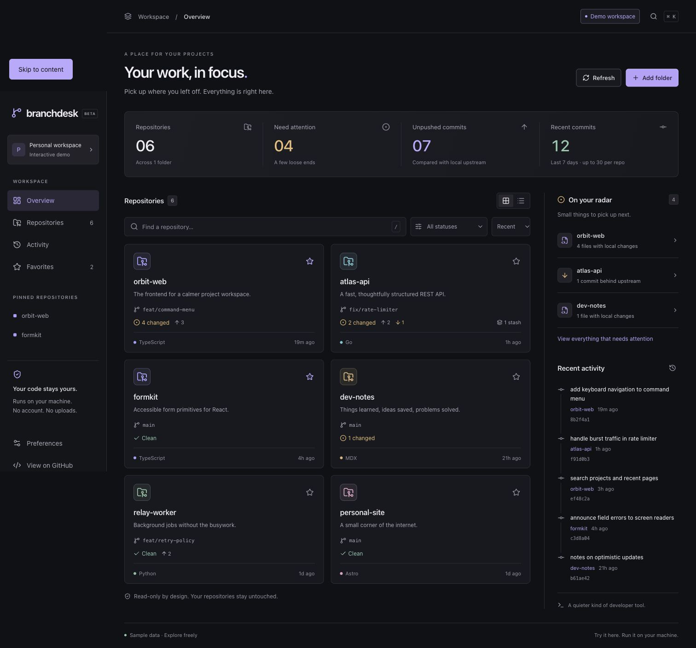
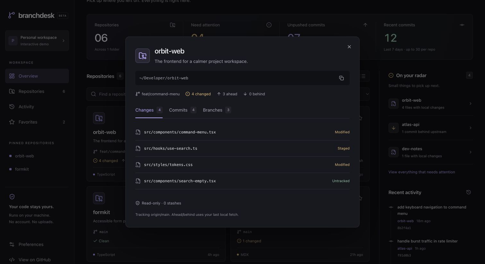
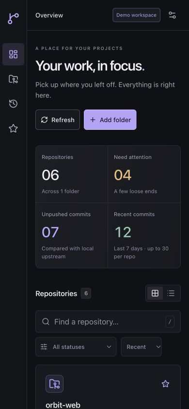

<div align="center">
  
  <h1>Branchdesk</h1>
  <p><strong>Your local repositories, back in focus.</strong></p>
  <p>A calm, read-only workspace for the projects on your machine.<br/>Find unfinished work, check your branches, and pick up where you left off.</p>
  <p><a href="https://mahmoudaladin7.github.io/branchdesk/">Try the live demo</a> · <a href="#quick-start">Run locally</a> · <a href="#a-closer-look">Screenshots</a> · <a href="docs/ROADMAP.md">Roadmap</a> · <a href="CONTRIBUTING.md">Contribute</a></p>
  <p><a href="https://github.com/mahmoudaladin7/branchdesk/actions/workflows/ci.yml"></a>  </p>
</div>

<picture>
  <source media="(prefers-color-scheme: light)" srcset="docs/screenshots/overview-light.png" />
  
</picture>

## Why Branchdesk?

You have a few side projects, a couple of work repositories, and a branch you meant to finish last week. Checking each directory separately gets old.

Branchdesk gives those repositories one home. It reads their Git metadata and puts unfinished work within reach. Use your terminal or editor to make changes; use Branchdesk to see where things stand.

**No account, access token, database, or cloud connection is required to run the local app.** The hosted demo uses fictional sample projects and never connects to your filesystem.

## What you can do

- **Scan your project folders.** Discover Git repositories and linked worktree folders under one or more roots.
- **See what needs attention.** Find local changes, merge conflicts, commits ahead of upstream, and branches behind upstream.
- **Look inside a repository.** Inspect changed filenames, staging states, recent commits, local branches, and stash counts.
- **Find your next task.** Search by name, branch, language, or description; filter by status and sort by activity, name, or attention.
- **Keep favorites close.** Pin repositories and switch between grid and list layouts.
- **Make the workspace yours.** Dark and light themes, responsive layouts, keyboard search, and optional automatic refresh.

Branchdesk does **not** commit, push, fetch, switch branches, open terminals, or execute project scripts. Its Git operations are read-only. Ahead/behind counts use the upstream refs already on your machine, so run `git fetch` yourself when you want fresh remote information.

## Quick start

You need **Node.js 22.13+**, **npm**, and **Git** on your PATH.

```sh
git clone https://github.com/mahmoudaladin7/branchdesk.git
cd branchdesk
npm ci
npm run build
npm start -- --root ~/Developer
```

Open **http://127.0.0.1:4317**. Replace `~/Developer` with the folder containing your projects. Press `Ctrl+C` in the terminal to stop the server.

For a path with spaces:

```sh
npm start -- --root "/Users/you/My Projects"
```

Track several folders, or choose a different port:

```sh
npm start -- --root ~/work --root ~/side-projects --port 4400
```

With no `--root`, Branchdesk scans the current working directory. **Add folder** adds another root for the current running session. Launch with `--root` arguments to reproduce your workspace after restarting.

### Explore the interface only

```sh
npm ci
npm run dev
```

The Vite development server serves the **sample-data demo** at http://127.0.0.1:5173. To test real Git data after UI changes, rebuild and run `npm start`.

[Try the live demo](https://mahmoudaladin7.github.io/branchdesk/) without installing anything. It uses fictional sample repositories and never connects to your filesystem. GitHub Pages redeploys the demo when changes land on `main`; see [publishing the demo](docs/ARCHITECTURE.md#publishing-the-demo).

### Optional local command

After building, you can link the command on your machine:

```sh
npm link
branchdesk --root ~/Developer
```

There is no published npm registry package in v0.1.0. Use the source setup above; `npx branchdesk` is not an installation instruction for this release.

## A closer look



<details>
<summary>Mobile view</summary>
<br/>

</details>

### Keyboard shortcuts

| Shortcut | Action |
| --- | --- |
| `/` | Focus the repository search field |
| `⌘ K` / `Ctrl K` | Open quick search |
| `Esc` | Close a dialog |
| `Tab` / `Shift Tab` | Move between controls |

## How it works

```text
Your project folders
        │
        ▼
Node.js local server ── read-only Git commands
        │
        ▼
http://127.0.0.1:4317 ── React dashboard in your browser
```

The UI is built with React, TypeScript, Vite, Tailwind CSS, and Radix primitives. The local server uses Node.js built-ins and Git; the packaged runtime has no npm dependencies. The same UI can be deployed as a static demo, where the local API is absent and only sample data is displayed.

See [Architecture](docs/ARCHITECTURE.md) and [Security](SECURITY.md) for details.

## Current boundaries

v0.1.0 is an early, useful release with a deliberately small scope:

- Discovery goes **3 levels below each root**, skips symlinks and dependency/build folders, and caps a scan at **200 repositories / 10,000 directories**. Add a deeper folder as a root when needed.
- Worktrees are discovered when their directories are within a selected root. Bare repositories and worktrees outside your roots are not listed automatically.
- Commit history shows the **latest 30 commits on the current branch** per repository. The seven-day summary counts only commits in that window, across all authors; it is not a complete contribution count and may count shared history in separate worktrees.
- “Last activity” is the latest commit time, not the last filesystem edit. Language is estimated by tracked file extensions, not lines of code.
- Status is refreshed on request, or every **30 seconds** while the tab is visible. There is no remote fetch or filesystem watcher.
- Folder roots live for the server session; pins, layout, and theme live in this browser's local storage.
- You can inspect changed filenames and staging states. Line-by-line diffs, PRs, CI status, and Git write operations are outside this release.

## Development

```sh
npm ci
npm run dev       # Sample-data UI with hot reload
npm test          # Real Git fixtures + local HTTP integration tests
npm run check    # TypeScript validation
npm run build    # Type-check and create the static client
npm run format   # Format source with Prettier
```

Tests cover renamed and untracked files, staging states, empty repos, detached HEAD, ahead/behind counts, worktrees, unsafe remote URLs, origin/host validation, and filesystem boundaries. They create temporary repositories and do not inspect your personal projects.

The CI workflow runs the checks on Ubuntu and macOS with Node.js 22 and 24. Windows paths are accepted by the local runtime, but Windows-specific validation is still on the roadmap.

## Help shape it

The next improvements should come from how people actually use Branchdesk. [Report a bug](https://github.com/mahmoudaladin7/branchdesk/issues/new?template=bug_report.yml), [suggest a focused improvement](https://github.com/mahmoudaladin7/branchdesk/issues/new?template=feature_request.yml), or read the [contribution guide](CONTRIBUTING.md).

If Branchdesk makes your day a little easier, a star helps others discover it.

## License

[MIT](LICENSE) © 2026 Mahmoud Aladin.
